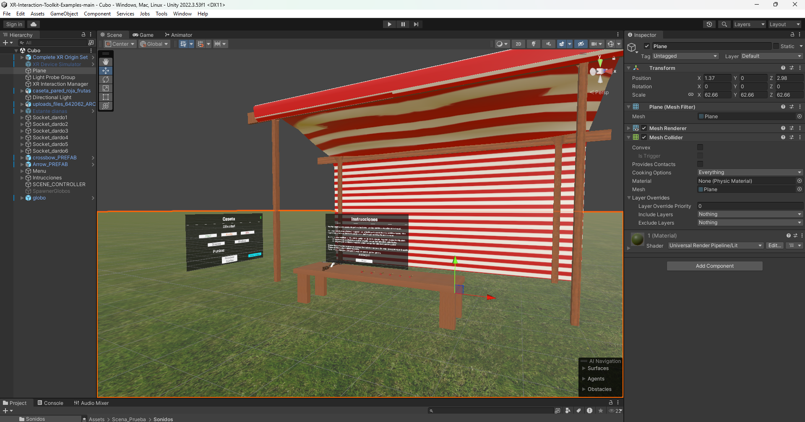
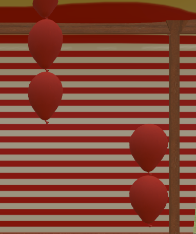
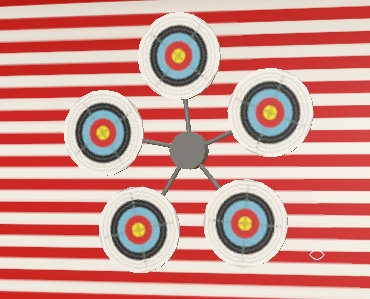

# 🎡 Caseta de Feria – Juegos de Dardos  

  
  

## 📌 Descripción  

Este proyecto recrea una **caseta de feria interactiva** con dos juegos clásicos:  

1. 🎯 **Lanzamiento de dardos a globos** – El objetivo es explotar el mayor número posible de globos.  
2. 🏹 **Lanzamiento de dardos a dianas móviles** – El reto aumenta con dianas que se mueven dinámicamente.  

Fue desarrollado junto a un compañero, poniendo en práctica **trabajo en equipo, organización de tareas y coordinación técnica**.  

---

## 🚀 Tecnologías utilizadas  

- **Motor de desarrollo:** Unity  
- **Lenguaje:** C#  
- **Librerías y herramientas:**  
  - [XR Interaction Toolkit](https://docs.unity3d.com/Packages/com.unity.xr.interaction.toolkit@2.4/manual/index.html) – Interacciones inmersivas en VR.  
  - [DOTween](http://dotween.demigiant.com/) – Animaciones y transiciones fluidas.  
  - Git/GitHub – Control de versiones y trabajo colaborativo.  

---

## 🖼️ Capturas  

- Vista general de la caseta:  
    

- Juego de dardos a globos:  
    

- Juego de dardos a dianas móviles:  
    

---

## 👥 Autores  

- [Enrique Morcillo Martínez](https://github.com/kitex03)  
- [Alvaro Franco]

---

## ✨ Aprendizajes  

- Diseño y desarrollo de **mecánicas de juego inmersivas** en Unity.  
- Uso de **XR Interaction Toolkit** para crear interacciones en VR.  
- Implementación de **animaciones dinámicas** con DOTween.  
- **Gestión de proyecto en equipo**: planificación, distribución de tareas y control de versiones con Git.  

